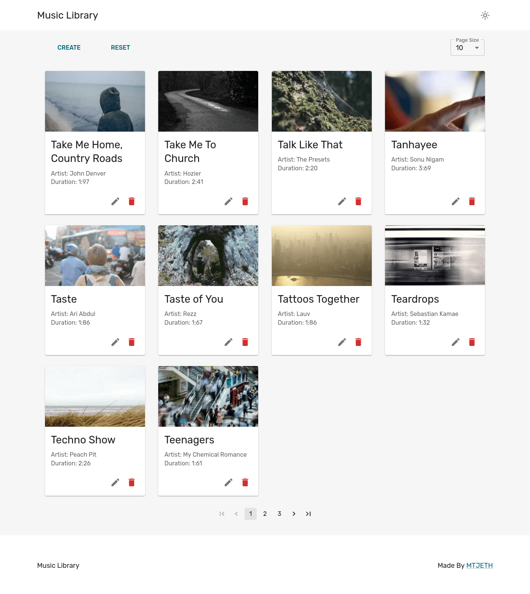

# Addis Software Test Project - Song Library

- This is a solution to Addis Software Test Project for internship.
- Photos Are Random generated from [Lorem Picsum](https://picsum.photos/).

## Overview

### The challenge

Users should be able to:

- Change to light and dark mode
- Read Songs
- create Songs
- update Songs
- delete Songs
- Select Amount of song to list per page

### Screenshot

#### Dark Design

- 
- 
- 
- 

#### Light Mode

- 
- 
- 
- 

### Links

- Solution URL: (https://github.com/mtjeth/music_CRUD_website)
- Live Site URL: (https://music.mtjeth.com/)
- Live Api URL: (https://musicapi.mtjeth.com/)

### Built with

- ReactJS
- Redux Toolkit  
- Redux - Saga 
- Emotion and Styled system 
- ExpressJs 
- Vite

## Author

- Website - [MTJ](https://www.mtjeth.com)
